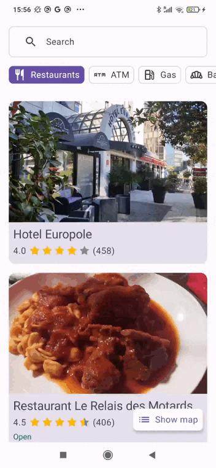
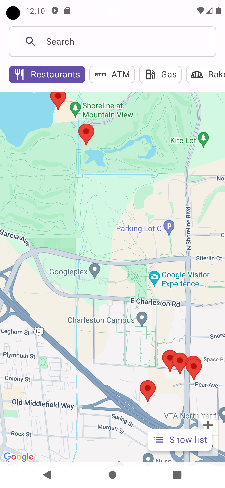

# Welcome! 👋

Welcome to ZePlace app.
This is an Android application that fetches nearby places and displays them on a list or a map.

## Features

- Fetches and displays nearby places.
- View places in a list or on a map.
- Filter by place type (restaurant, gas station,...)
- Intuitive and user-friendly interface.
- Efficient data fetching and caching.

## How to run the project 📦

1. Install Android Studio (latest version);
2. Select the option to open a project;
3. Select the project -> ⚠️ The project is inside of the `src` directory ⚠️
4. Get a Google Map API key.
5. Create a secrets.properties file at the root of the project and add this line: MAPS_API_KEY = "YOUR_API_KEY"

## How to get a Google Map API key? 👮 
To generate an API, visit [Google Places](https://developers.google.com/maps/documentation/places/android-sdk/cloud-setup) and follow the instructions

## Screenshots 🎬
- **Video**

-  **List view**

-  **Map view**

### Tech stack summary 🛠️
- [Jetpack Compose](https://developer.android.com/jetpack/compose) - UI toolkit for building native Android UI
- [Koin](https://github.com/InsertKoinIO/koin) - Dependency injection
- [Ktor](https://ktor.io) - Network requests
- [Google Maps]([https://developers.google.com/maps/documentation/android-sdk/overview](https://developers.google.com/maps/documentation/android-sdk/maps-compose)) - Maps Compose Library
- [Google Play Services Location](https://developers.google.com/android/reference/com/google/android/gms/location/package-summary) - Location services
- [Coil](https://coil-kt.github.io/coil/) - Image loading library for Android backed by Kotlin Coroutines
- [Jetpack Compose Permissions](https://google.github.io/accompanist/permissions/) - Android runtime permissions support for Jetpack Compose
- [Kotlinx Serialization](https://github.com/Kotlin/kotlinx.serialization) - Kotlin serialization library
- [Detekt](https://detekt.dev/docs/intro) - Code smell analysis for Kotlin projects

